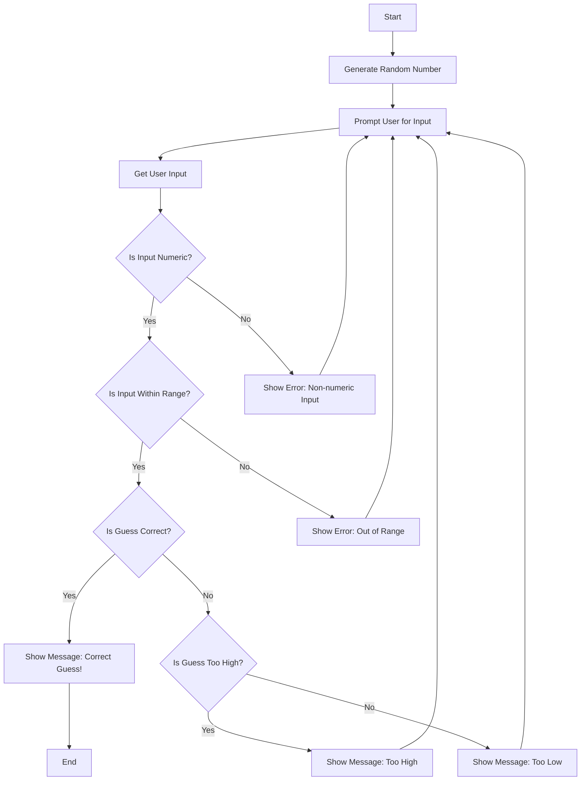

Documentation:

Start: The game begins, initializing the process.

Generate Random Number:

A random number is generated within a predefined range (e.g., 1 to 100).
Prompt User for Input:

The user is prompted to enter their guess.
Get User Input:

The game captures the user’s input.
Is Input Numeric?:

The game checks if the input is a numeric value.
If Yes, proceed to the next step.
If No, show an error message indicating that the input must be numeric and return to the input prompt.
Is Input Within Range?:

The game checks if the numeric input falls within the acceptable range.
If Yes, proceed to the next step.
If No, show an error message indicating that the input is out of range and return to the input prompt.
Is Guess Correct?:

The game checks if the user’s guess matches the generated random number.
If Yes, show a message saying "Correct Guess!" and proceed to end the game.
If No, proceed to the next step.
Is Guess Too High?:

The game determines if the guess is higher than the random number.
If Yes, show a message saying "Too High" and return to the input prompt.
If No, the guess must be too low, so show a message saying "Too Low" and return to the input prompt.
End:

The game concludes after the user guesses correctly, and any necessary cleanup or summary actions can be taken.